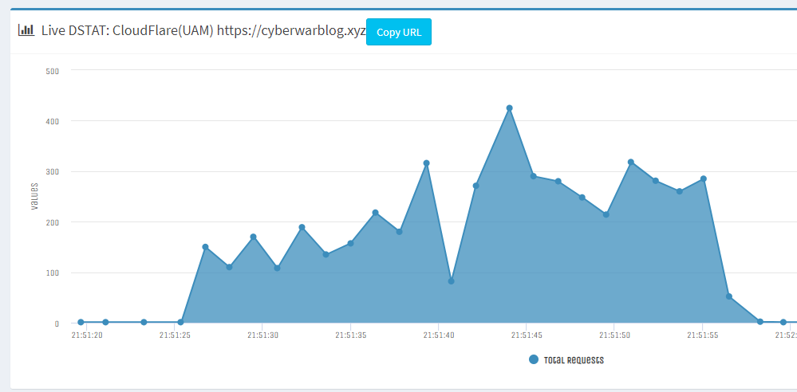

# CFUnmitigate

[](https://github.com/codemanki/cloudscraper)
[](https://travis-ci.com/Mrakovic-ORG/CFUnmitigate)

UAM Bypass only by using CloudScraper requests.



### Install
```sh
git clone https://github.com/Mrakovic-ORG/CFUnmitigate
cd CFUnmitigate
npm install
node CFUnmitigate.js
```
### Disclaimer
We are not responsible for any damage done with this script, its has been made for educational purpose.

